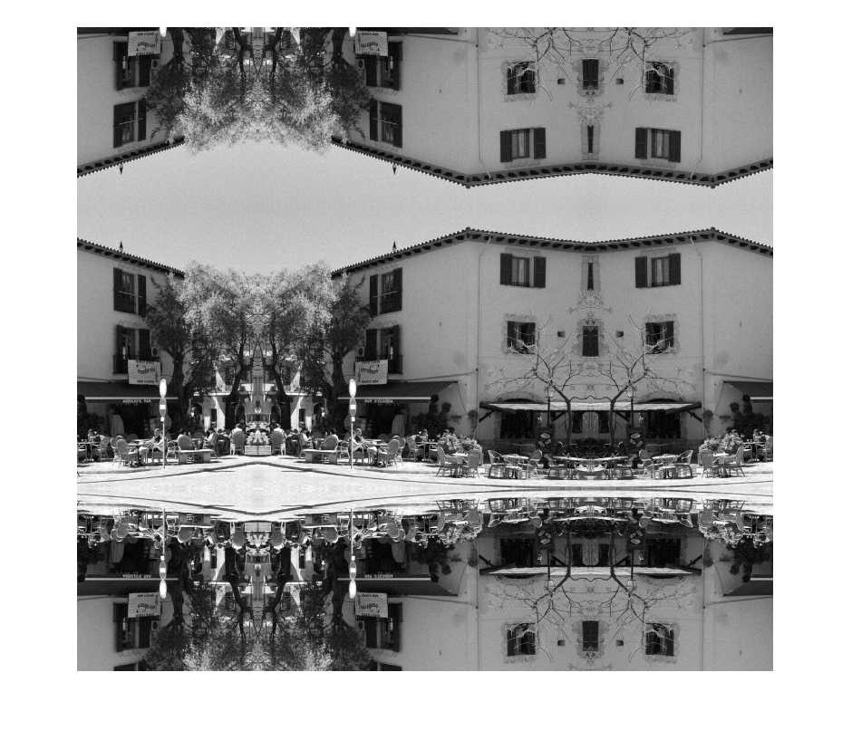

# Non Local Means De-noising Coursework
### By Daniel Eldar

## File Guide
This section shows you which files do what and which files should be run for each task.

#### Image Files

#### Coursework Files
The coursework files, are the files which should be run in order to see the code running for each task. Those files are:
##### Core Section Files

##### Advanced Section Files

#### Algorithm Files

## Section A
### Task 1 - Definition of Integral Image

An integral image II is an image of the same size as another image IO which stores the sum of the pixels in the rectangle bounded by a corner of the image and the pixel position it is at.

For example, the integral image of the following:

| 5 | 7 | 15|

| 8 | 9 | 3 |

| 4 | 23| 1 |

is

| 5 | 12 | 27 |

| 13 | 29 | 47 |

| 17 | 56 | 75 |

Integral images help us find the square difference of patches within the image in constant time by creating the integral image of the offset.

In order to calculate it you can use the following algorithm:

`function getIntegralImage(Image)

integralImage = buffer same size as Image

integralImage(1,1) = Image(1,1);

for x = 1 to ImageWidth
  for y = 1 to imageHeight
    if(x == 1 && y == 1)
    //Do nothing.
    else
      imageSample = Image(x,y);
      verticalSample =0; horizontalSample = 0; sampleToRemove = 0;
      if(y-1 >= 1)
          verticalSample = ii(x,y-1);
      else
          verticalSample = 0;
      end
      if(x-1 >= 1)
          horizontalSample = ii(x-1,y);
      else
          horizontalSample = 0;
      end
      if(y-1 >= 1 && x-1 >= 1)
          sampleToRemove = ii(x-1,y-1);
      else
          sampleToRemove = 0;
      end
      integralImage(x,y) = imageSample + horizontalSample + verticalSample - sampleToRemove;
    end //if(x == 1 && y == 1)
  end
end

end //getIntegralImage function`

The way it works is by taking in the image you want to produce the integral image for, and then it order to start, it sets the first value of the integral image to be the first value of the original image. Once that is done, it loops through all of the pixel locations and calculates the value at the given pixel by doing the following:

| II(x-1,y-1) | II(x,y-1) |

| II(x-1,y) | II(x,y) |

| I(x-1,y-1) | I(x,y-1) |

| I(x-1,y) | I(x,y) |

where `II(x,y) = I(x,y) + II(x,y-1) + II(x-1,y) - II(x-1,y-1)`

### Task 2 - Integral Image Acceleration of template matching
#### Task 2 - Part A
In template matching, we have to calculate the squared difference for a patch with every other patch within our defined window, but if we calculate it pixel by pixel for every patch and every offset that will be very computationally expensive. However, integral images can do it in a constant time.

The way it works is by having an integral image for the offset that we want to look at. For example, if the centre of the patches that we want to look at is (-1,-1) from the pixel we are trying to denoise, we will make a difference image with an offset of (-1,-1) by doing the following:

`DifferenceImage(x,y) = (DifferenceImage(x,y) - DifferenceImage(x+offsetX,y+offsetY))^2`
`
When this difference image is produced, we can create an integral image for that difference image, and from that we can get the difference between any two patches which have their centre pixels at the offset (offsetX, offsetY). We do this in the following way:

PatchDistance = II(centreX + patchSize/2, centreY + patchSize/2) - II(centreX - 1 - patchSize/2, centreY+patchSize/2) - II(centreX+patchSize/2,centreY-1-patchSize/2) + II(centreX-1-patchSize/2,centreY-1-patchSize/2)

That will give us the difference for a patch size and centre of the original pixel we were looking at.

Then, if we create an integral image per offset that we need. That will save a lot of computations by being able to retrieve the difference for a given offset easily.

The difficulty with this is that the bigger your window is the more memory you have to use as you need (windowSize)^2 number of integral images, one for each offset, however, you do not need all of the integral images in memory at the same time so that issue can be avoided. Furthermore, when creating the difference image, borders can cause a problem as they can affect the result we are given by the distance function. Therefore, a way to avoid those problems is by padding the image out with a size which will cover the window and patch size furthest away possibility and filling it with relevant data. For example, by filling it with a reflected version of the image like so:

Using this technique we can get the differences in constant time which means that we are avoiding a lot of repeat calculations and therefore, accelerating the process.

#### Task 2 - Part B

The first function defined is `getDifferenceImage` which calculates the new difference image with the offset given to it, the pseudo-code for it is:

`function getDifferenceImage(Image, offsetX, offsetY)
// Image passed is already the padded one.

differenceImage = buffer the size of the Image.

for x from 1 to ImageWidth
  for y from 1 to ImageHeight
    offsetXIndex = clamp(x+offsetX, 1, imageWidth)
    offsetYIndex = clamp(y+offsetY, 1, imageHeight)
    differenceImage(x,y) = (Image(x,y) - Image(offsetXIndex, offsetYIndex))^2
  end //for y
end //for x

return differenceImage

end //getDifferenceImage function`

The parameters given to it are: `Image`, `offsetX` and `offsetY`.

 - `Image` is the image that we want to get a difference offset for.
 - `offsetX` a `offsetY` are just the offset values that we want to use for the difference image.

 Then the function works by creating a buffer for the new image of the same size as the image given to it and then it loops through all of the pixels and produces a squared difference values in the buffer it created.

The second function is the function that creates the integral image, it is the same algorithm as shown above and works the same way.

`function getIntegralImage(Image)

integralImage = buffer same size as Image

integralImage(1,1) = Image(1,1);

for x = 1 to ImageWidth
  for y = 1 to imageHeight
    if(x == 1 && y == 1)
    //Do nothing.
    else
      imageSample = Image(x,y);
      verticalSample =0; horizontalSample = 0; sampleToRemove = 0;
      if(y-1 >= 1)
          verticalSample = ii(x,y-1);
      else
          verticalSample = 0;
      end
      if(x-1 >= 1)
          horizontalSample = ii(x-1,y);
      else
          horizontalSample = 0;
      end
      if(y-1 >= 1 && x-1 >= 1)
          sampleToRemove = ii(x-1,y-1);
      else
          sampleToRemove = 0;
      end
      integralImage(x,y) = imageSample + horizontalSample + verticalSample - sampleToRemove;
    end //if(x == 1 && y == 1)
  end
end

end //getIntegralImage function`

It takes only one parameter:
 - `Image` is the image which should be converted into an integral image.

Finally, to actually get the value of the patch differences, we use the function `getSumOfPatch`.
The function is as follows:

`function finalSample = getSumOfPatch(integralImage, xLower, yLower, xUpper, yUpper)

[imageWidth, imageHeight, colours] = size(integralImage);

if(xUpper > imageWidth)
    xUpper = imageWidth;
end
if(xLower > imageWidth)
    xLower = imageWidth;
end
if(yUpper > imageHeight)
    yUpper = imageHeight;
end
if(yLower > imageHeight)
    yLower = imageHeight;
end
fullSample = integralImage(xUpper, yUpper);
sampleToDeleteA = integralImage(xUpper, yLower-1);
sampleToDeleteB = integralImage(xLower-1, yUpper);
sampleToAddBack = integralImage(xLower-1, yLower-1);

finalSample = double(fullSample) - double(sampleToDeleteA) - double(sampleToDeleteB) + double(sampleToAddBack);

end`

The parameters it takes is as follows:
 - `integralImage` is the integral image which stores the information that we want to retrieve.
 - `xLower`, `yLower`, `xUpper` and `yUpper` are the bounds of the patch that we want to get the difference for. The centre point of the bounds is the pixel that you want to de-noise. The bounds are calculated using the patchSize that we are using.

### Task 3 - Naive Template Matching

#### Task 3 - Part A
Implemented in the file `templateMatchingNaive.m`

#### Task 3 - Part B

The way that the implementation works is like so:

`function templateMatchingNaive(row, col, patchSize, searchWindowSize, image)

lowerYValue, lowerXValue,upperYValue,upperXValue
// Calculated based on the window size as they would have a different offset if the window size is even or odd.

paddedImage = getPaddedImage(image, windowSize, patchSize) //calculates the padded reflected image like the one shown before.

(lowerYValue, lowerXValue, upperYValue, upperXValue) + (windowSize+patchSize)/2
//Makes sure that they are in the correct position for the padded image.

offsetRows = {} //empty
offsetCols = {} //empty
distances = {} //empty

counter = 1
for x = lowerXValue to upperXValue
  for y = lowerYValue to upperYValue
    //Loops through just the relevant coordinates.
    // Gets the offset to populate in the array.
    xOffset = x - col - paddingSize
    yOffset = y - row - paddingSize
    // Gets the patch distance with the two patch centres.
    patchDistance = getSumOfPatch(paddedImage, x, y, patchSize, col + paddingSize, row + paddingSize)
    //Populates the arrays passed out.
    offsetsCols(counter) = xOffset
    offsetsRows(counter) = yOffset
    distances(counter) = patchDistance
    counter++
  end // y
end // x

return offsetCols, offsetRows, distances

end //function templateMatchingNaive
`

The function above calculates the distances between the centre patch and the outside patches in the window specified using the patch size specified. It uses other auxilary functions to calculate the various data sets it needs to produce the final data set for the distances and the offset arrays. One of the important bits of information here is to make sure that the padded image is handled correctly to make sure that we do not get odd artefacts when de-noising. Furthermore, we have to make sure that after padding the original image, our calculations are still looking at the same pixel and that regardless of whether the patch and window sizes are odd or even, it behaves correctly and in a predictable manner.
The paramters that are given to it are:
 - `row`, `col`, are the original patch centre coordinates that we are looking at to compare with the other patches. (The centre pixel of the patch is the one we are looking to de-noise).
 - `patchSize`, `searchWindowSize` are the sizes of the patches we are comparing and the size of the window we are looking in. (There will be searchWindowSize^2 patches)
 - `image` is the image that we want to de-noise.

`function getSumOfPatch(image, xPosition, yPosition, patchSize, originalX, originalY)

lowerYValue, lowerXValue,upperYValue,upperXValue
// Calculated based on the patch size as they would have a different offset if the patch size is even or odd.
imageHeight, imageWidth // Retrieved from the image

sumOfPatch = 0;

for x = lowerXValue : upperXValue
    for y = lowerYValue : upperYValue
        // Loops through the original and offset patchs' pixels
        // and calculates the sqaured difference between them and adds them to
        // the sum.
        newPatchCentreXOffset = x - xPosition
        newPatchCentreYOffset = y - yPosition
        originalXPosition = originalX + newPatchCentreXOffset
        originalYPosition = originalY + newPatchCentreYOffset

        originalXPosition = clamp(originalXPosition, 1, imageWidth)
        originalYPosition = clamp(originalYPosition, 1, imageHeight)

        newXPosition = x
        newYPosition = y

        newXPosition = clamp(x, 1, imageWidth)
        newYPosition = clamp(y, 1, imageHeight)

        originalSample = image(originalXPosition, originalYPosition)
        newSample = image(newXPosition, newYPosition)

        differenceSquared = (originalSample-newSample)^2

        sumOfPatch = sumOfPatch + differenceSquared
    end // y
end // x

end // function getSumOfPatch`

The function above calculates the SSD of the two patches. It does so by looping through all of the pixels within those patches and getting the squared difference between them and adding it to the sum total.
The parameters given to it are:
 - `image` is the image we want to de-noise, we use it to retrieve the value of the pixels so that we can calculate the SSD of the two patches.
 - `xPosition`, `yPosition` are the centre coordinates of the new patch that we are looking to compare to the original one so that we can de-noise the pixel at the centre of the original patch.
 - `originalX`, `originalY` are the coordinates of the pixel that we want to de-noise. It is the centre of our original patch.
 - `patchSize` is the size of the patch that we are looking at. We use it to determine which pixels we should look at to calculate the SSD between the two patches.

`function getPaddedImage(image, windowSize, patchSize)

paddingSize = (windowSize+patchSize)*2 // Makes sure that the padding covers the furthest our algorithm will need.
imageWidth, imageHeight // Taken from the image parameter
paddedImage = buffer sized (imageWidth+paddingSize, imageHeight+paddingSize, ...(additional dimensions needed.));

for x = 1 : imageWidth+paddingSize
    for y = 1 : imageHeight+paddingSize
        // Make sure that the value is never below 1.
        // It also allocated half the padding size on each side of the image.
        positionXInOriginal = abs(x - (paddingSize/2))+1
        positionYInOriginal = abs(y - (paddingSize/2))+1

        // Make sure that the value is never above the dimensions of the image.
        if(positionXInOriginal > imageWidth)
            positionXInOriginal = imageWidth - (positionXInOriginal - imageWidth)
        end //if(positionXInOriginal > imageWidth)
        if(positionYInOriginal > imageHeight)
            positionYInOriginal = imageHeight - (positionYInOriginal - imageHeight)
        end // if(positionYInOriginal > imageHeight)
        // Gets the sample we want and set it in the padded image.
        currentImageSample = image(positionXInOriginal, positionYInOriginal)
        paddedImage(x,y) = currentImageSample
    end // y
end // x

end // function getPaddedImage`

This function creates the padded image for the algorithm to work. This padding creates a reflected version of the image along the borders as seen in the figure before. The way it works is by creating a new buffer which is bigger than the original image and then copying the data appropriately to create the new padded image.
 - `image` is the image that we want to pad out.
 - `windowSize` and `patchSize` are the window size that we are looking at and the patch size that we looking at respectively.

### Task 4 - Integral Image Template Matching
#### Task 4 - Part A
Implemented in the file `templateMatchingIntegralImage.m`

#### Task 4 - Part B
The way the implementation works is like so:

`function templateMatchingIntegralImage(row, col, patchSize, searchWindowSize, image)

lowerYValue, lowerXValue,upperYValue,upperXValue
// Calculated based on the window size as they would have a different offset if the window size is even or odd.

lowerOffset = 0, upperOffset = 0;
//Calculated based on the patch size.

paddedImage = getPaddedImage(image, windowSize, patchSize) //calculates the padded reflected image like the one shown before.

(lowerYValue, lowerXValue, upperYValue, upperXValue) + (windowSize+patchSize)/2
//Makes sure that they are in the correct position for the padded image.

offsetRows = {} //empty
offsetCols = {} //empty
distances = {} //empty

counter = 1;
for x = lowerXValue : upperXValue
    for y = lowerYValue : upperYValue
        //Loops through all of the relevant pixel coordinates.

        //Calculates the correct offset to populate in the arrays
        xOffset = x - col - paddingSize
        yOffset = y - row - paddingSize

        // Calculates the difference image.
        // The function is explained along with pseudo-code above.
        differenceImage = getDifferenceImage(paddedImage, xOffset, yOffset)

        //Calculates the integral image.
        // The way it worked is explained along with pseudo-code above.
        integralImage = computeIntegralImage(differenceImage)

        //Gets the patch difference value using the function we defined above.
        // The parameters passed to it are the bounds of the patch so that we can get the correct difference.
        // The function to get the distance is defined along with pseudo-code above.
        patchDistance = getSumOfPatch(integralImage, col-lowerOffset+paddingSize, row-lowerOffset+paddingSize, col+upperOffset+paddingSize, row+upperOffset+paddingSize)

        //populates the arrays.
        offsetsCols(counter) = xOffset
        offsetsRows(counter) = yOffset
        distances(counter) = patchDistance
        counter++;
    end //y
end //x
end // function templateMatchingIntegralImage`

The function above calculates the distances between the patch around the centre it is given and the other patches within the window size it is provided. It worked by using the other functions defined to calculate the data it needs to calculate the final data set of the distances between the patches. The same important aspects from the last section applies here, with the added bit of having to make sure that you calculate the correct difference image and the difference patch from your integral image, as well as use the correct bounds to retrieve the distance values.
The parameters it is given are:
 - `row` and `col` are the coordinates of the centre pixel (the pixel we want to de-noise) in the patch that we are looking at.
 - `windowSize` and `patchSize` are the window size that we are looking at and the patch size that we looking at respectively.
 - `image` is the image that we are looking to de-noise.

### Task 5 - Circumstances where Native is faster than Integral image
The naive approach will be faster for some circumstances, for example, if the image is very large, that can cause quite a large problem for the integral image method as that the calculation of the integral image as well as storing all of the integral images in memory can be very taking and slow down the algorithm, however, the naive approach only needs one copy of the image and won't incur the additional memory overheads that the integral image method imposes.

### Task 6 - Performance Bottlenecks
#### Task 6 - Naive Performance Bottlenecks
In the naive method there is a quite obvious bottleneck being the running time of the algorithm on images. This is due to the fact that it runs in O(patchSize * windowSize * imageWidth * imageHeight) which as images get bigger, becomes quite unruly, and with standard image sizes will often be in excess of O(n^2) order and with the addition of window and patch sizes, can possibly even exceed O(n^3). However, one solution this can be handled by is with the use of parallel computing where for example, on a GPU, it would be possible to perform those operation very quickly, furthermore, the fact that only one copy of the image is needed means that not a lot of memory is needed to run it.

#### Task 6 - Integral Image Performance Bottleneck
The integral image method's main bottleneck is the memory requirement needed to actually run the algorithm as with every offset needed you need another integral image the same size as the original. This creates a memory requirement of a size O(windowSize^2 * imageWidth * imageHeight). That can get very large very quickly as you make your window larger and larger. However, not all of them need to be stored in memory at the same time and each one can be calculated, used and discarded which means you only have to keep one integral image in memory along with the original image.

### Task 7 - Image Border Justification
The way that I dealt with the image borders is by padding the image out with a reflected version of the image around the original and then using running the algorithm only within the original bounds of the image, this means that we do not create any artificial edges which could affect the results negatively as we are extending the data we already have in a natural way. Furthermore, as it is reflected instead of repeated, it means that the colours will always be the same which means we will not have any strong differences and the similarities could affect the results positively while allowing us to run the algorithm efficiently. One problem with it is that it increases the size of the image we are working with and therefore increasing the amount of time and memory we need to run the algorithm, however, as it is only padded by `((windowSize+patchSize)*2)` it means that we won't add to much to the image for most typical values.

## Section B
### Task 1 - Non-Local Means Filtering
#### Task 1 - Part A
Implementation found in `nonLocalMeans.m` and run from `advancedSection.m`.

#### Task 1 - Part B
The implementation of the algorithm for the de-noising uses the integral image technique for getting the squared sum distance from the image for the different patches. The way that it de-noises the image is by:

1. Padding the image as shown above to avoid any artifacts from empty edges.
2. For every offset inside the window, we create an offset image and then create an integral image for that difference image.
3. For every pixel in the image, for every offset, we take the SSD between the patch around that pixel and the other pixel with the offset we are looking at.
4. We use that difference to calculate the pixel weighting and add the weight to an array we created earlier in the cell for that pixel and add the `pixel * weight` into a cell in another array that we created.
5. After we operate on all pixels in the image, we go through the array with the sum of `pixel * weight` and divide it by the sum of the weight relevant for that pixel, that provides our image.

**Implementation Pseudo-code**

`function nonLocalMeans(image, sigma, h, patchSize, windowSize)

[paddedImage, paddingSize] = padImage(image, windowSize, patchSize);

setOfOffsets, numberOfOffsets // Calculated using the windowSize
lowerPatchOffset, upperPatchOffset // Calculated using the patchSize

newImage // Buffer same size as the *padded* image.
weightSumImage // 1-D buffer, same size as the image to hold the weight sums.

[imageWidth, imageHeight, ~] = size(image);
for windowXOffsetIndex = 1 : numberOfOffsets
    for windowYOffsetIndex = 1 : numberOfOffsets

        windowXOffset = setOfOffsets(windowXOffsetIndex);
        windowYOffset = setOfOffsets(windowYOffsetIndex);
        differenceImage = getDifferenceImage(paddedImage, windowXOffset, windowYOffset);
        integralImage = computeIntegralImage(differenceImage);

        for x = paddingSize-1 : imageWidth+paddingSize-1
            for y = paddingSize-1 : imageHeight+paddingSize-1
                patchLowerXPosition = x - lowerPatchOffset;
                patchLowerYPosition = y - lowerPatchOffset;
                patchUpperXPosition = x + upperPatchOffset;
                patchUpperYPosition = y + upperPatchOffset;

                patchDistance = getSumOfPatch(integralImage, patchLowerXPosition, patchLowerYPosition, patchUpperXPosition, patchUpperYPosition);

                pixelWeight = computeWeighting(patchDistance, h, sigma, patchSize);
                originalImageSample = paddedImage(x+windowXOffset,y+windowYOffset, :);
                weightedPixel = double(originalImageSample) * pixelWeight;
                newPixel = (newImage(x,y,:) + weightedPixel);
                newImage(x,y,:) = newPixel(:);
                weightSumImage(x,y) = weightSumImage(x,y) + pixelWeight;
            end
        end
    end
end

newImageDouble // New buffer the same size as the original image to make sure

for x = paddingSize : imageWidth+paddingSize-1
    for y = paddingSize : imageHeight+paddingSize-1
        currentNewImageSample = newImage(x,y,:);
        currentWeightSum = weightSumImage(x,y);
        currentNewImageSample = currentNewImageSample / currentWeightSum;
        newImageInt(x-paddingSize+1,y-paddingSize+1,:) = (currentNewImageSample(:));
    end
end
%imshow(newImage);
% imshow(newImageInt);
result = newImageInt;
end
`

### Task 2 - Parameters and results

### Task 3 - Selecting parameters in practice
