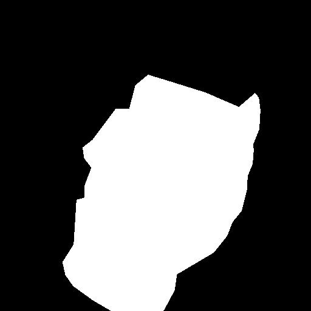
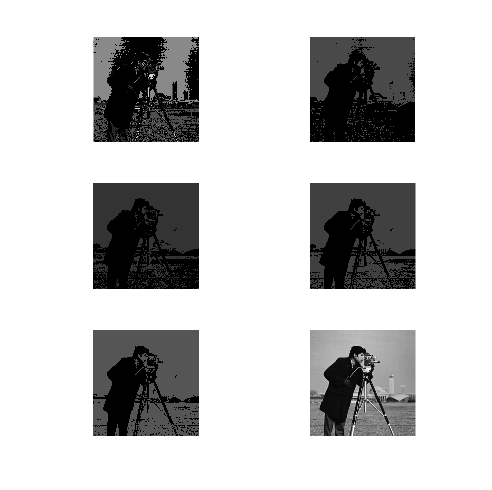
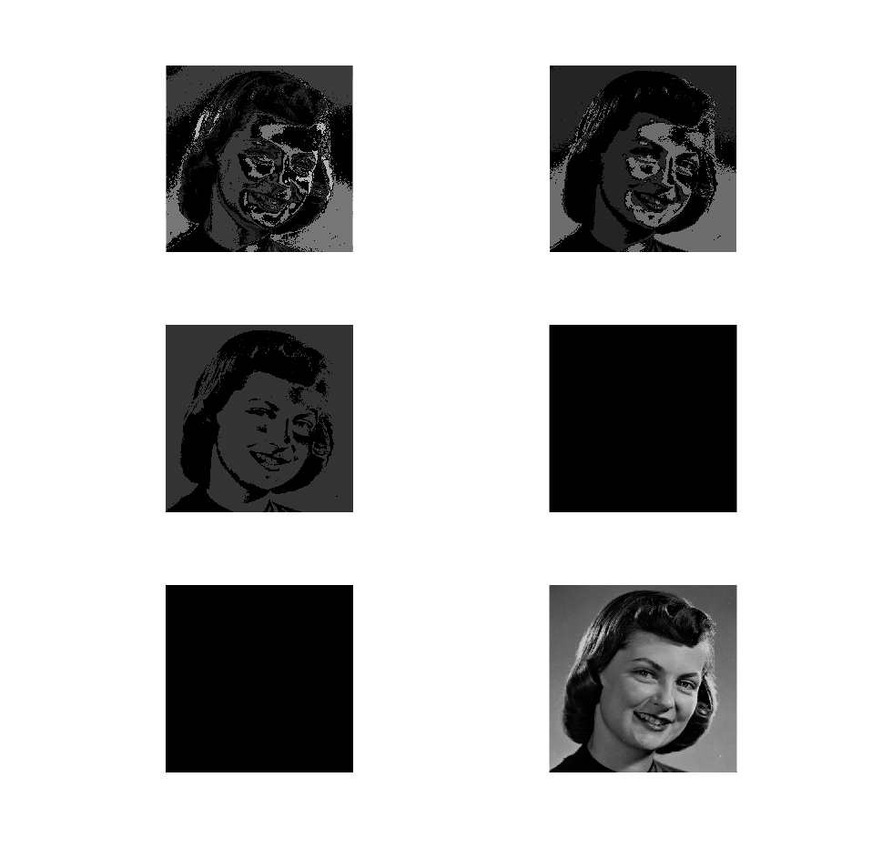

# Image Segmentation Coursework
### By Daniel Eldar
  
## File Guide
This section shows you which files do what and which files should be run for each task.

#### Image Files
The following image files have been included in this coursework:

- `girlface.bmp` : The original girlface image specified in the coursework.
- `girlfaceGT.bmp` : The ground truth prepared for the ROC curve analysis.
- `cameraman.tif` : The cameraman image used to compare the performance of some of the algorithms on several images.

| Girlface | Girlface Ground Truth | Cameraman |
|:-:|:-:|:-:|
||||

#### Coursework Files
The coursework files, are the files which should be run in order to see the code running for each task. Those files are:
##### Core Section Files
- `CourseworkHistogram.m` : This file should be run to see task 1 run and produce histograms for the images.
- `CourseworkThreshold.m` : This file should be run for task 2 and will produce a set of images with different thresholds based on the parameters in the file.
- `CourseworkROCThreshold.m` : This file is to be run for task 3 and will produce the ROC curve along with the desired operating point.

##### Advanced Section Files
- `CourseworkRegionGrowing.m` : This file is for task 1 and will produce the region growing algorithm for a the girlface image with the number of subdivisions as the parameter for how many seeds it should test. It also creates a figure per threshold to test. (As given, the default is 2 thresholds: 53 and 80).
- `CourseworkROCRegionGrowing.m` : This file is also for task 1 and will produce an ROC curve for different thresholds based on the pixel in middle of the image based on an 8 neighbourhood algorithm.
- `CourseworkMeanShift.m` : This file is for task 2 and this will show the output for the window sizes set and will produce those outputs for both the `cameraman` image and the `girlface` image and display them in different windows.

#### Algorithm Files
These files are the files which contain the actual algorithm used by the Coursework files (with the exception of `CourseworkROCThreshold.m` and `CourseworkROCRegionGrowing.m` which contain the algorithm for the ROC Curves within them):

- `GreyHistogram.m` : This file contains the algorithm to produce the histogram by taking an image and returning the histogram data. Note: It will only return the histogram data and the data needs to be plotted by a function like bar(), or by using the `CourseworkHistogram.m` file.
- `Threshold.m` : This file contains the algorithm to produce a new image from the image and threshold provided to it. It has a flag as to whether it should or should not display the result after calculation.
- `RegionGrowing.m` : This file contains the region growing algorithm. It takes as parameters the image, seed position, threshold and whether to use the 4 or 8 neighbourhood.
- `MeanShift.m` : This file contains the mean shift algorithm and will return the image output for what it has calculated, it takes the size of the window to use, the image and the number of repeats over the data.

## Core Section
### Task 1 - Histograms
The histogram task can be found in the **'CourseworkHistogram.m'** file and will take the **'girlface.bmp'** image and **'cameraman.tif'** in the folder, and use the function in **'GreyHistogram.m'** count the various intensities and return the histogram data for each image.
Afterward the histograms are shown as well as the histograms from MATLAB's histogram function.

 Camera Man Image | Girlface Image
:---------------------------------: | :--------------------------------:
 | 

As we can see from the histograms, the distribution across the greyscale of both images is quite different throughout the intensities.

### Task 2 - Thresholding
The thresholding task can be found in the **'CourseworkThreshold.m'** file, it will take the **'girlface.bmp'** image file and will run a loop with how many values we want and run it through the `Threshold` function found in **'Threshold.m'** with a calculated threshold from the loop index variable and store the subplot the image. The function call looks like so:

`Threshold(GirlfaceImage, ImageRepeat * (255 / NumberOfImages), true);`

Where the image is passed as `GirlfaceImage`, the threshold as `ImageRepeat * (255 / NumberOfImages)` and then the final parameter is whether `imshow` should be called on the results of the function (true means that it will be called therefore imshow doesn't need to be called in the **'CourseworkThreshold.m'** file).

After the loop the `Threshold` function is called again with the value I chose after running some tests and then the original image is shown on the figure.

The results of the file when it is run are:

The main problem with an algorithm like this is that it has a set threshold for whether the pixel is in the Region of Interest or not which means that as is the case with this image, if the Region of Interest Contains intensities that are also present somewhere else in the image, those are going to show up as the Region of Interest, there is not much that can be done about it in this algorithm.

Through the different values for the threshold in the image above it can be seen how it is quite difficult to separate the skin correctly using this method.

### Task 3 - Thresholding ROC Curve
The creation of a Receiver Operating Characteristic Curve can be found in the **'CourseworkROCThreshold.m'** file, it will read the **'girlface.bmp'** image file and will run the thresholding algorithm on it with the thresholding values between 0 and 255. It will then calculate the true positive fraction (sensitivity) and the false positive fraction (1 - specificity) by comparing the image returned with the ground truth constructed and stores them in an array. Once everything is calculated, the desired operating point is calculated in a separate function which is given all of the data and then the ROC curve is plotted using MATLAB's plot function.

The results of the code look like so:

As can be seen, the performance of the thresholding algorithm is reasonable, separating most of the skin in the image after the desired operating point is calculated, however, it still includes most of the background and even some of the hair in the Region of Interest which isn't really the best performance compared to what we want as can be seen in the ground truth.

The following is a comparison of the threshold from the trial and error approach which settles at 80 and the threshold from the calculation of the desired operating point which came out to 53:

As you can see the one with the calculated threshold got almost all of the skin, however, it got all of the background as well and quite a lot from the hair and clothing, while the trial and error, while getting a lot less of the skin, got much less of the background and other unwanted features.

## Advanced Section
### Task 1 - Region Growing
The region algorithm can be easily run through the **'CourseworkRegionGrowing.m'** file, which will run the algorithm with several seed locations and the neighbourhood that is set. The implementation of the algorithm can be found in the **'RegionGrowing.m'** file in the `RegionGrowing` function which can work with either a 4 neighnbourhood scheme or an 8 neighnbourhood scheme. Originally, for **'CourseworkRegionGrowing.m'**, the threshold values used for testing were the values from the previous thresholding algorithms to see the effect of the different seed locations on the Region of Interest. As can be seen in the images below, there isn't much difference between the difference positions as long as they are not in some very dark regions of the image:

| Neighbourhood Size  \  Threshold | 53  |  80|
|:-------------------------------:|:---:|:--:|
|   4 Neighbourhood  |         |      |
|   8 Neighbourhood  |        |      |

After those tests, the point `[256, 256]` was chosen to be the seed for the ROC curve calculations as it was a good point across all of the tests above which gave a reasonable region from it.

The following ROC curve was obtained by running the thresholds from 0 to 255 (inclusive) on the region growing algorithm with the seed `[256, 256]` (`CourseworkROCRegionGrowing.m` can be run to obtain that result) :

Along with the ROC curve you can see the region obtained from the suggested desired operating point calculated from the ROC curve. This one is quite different from the previous techniques as this one excludes a large amount of the background while getting most of the skin. However, it still missed quite a bit of it.

### Task 2 - Mean Shift
The mean shift task can be easily run through the **'CourseworkMeanShift.m'** file, in this algorithm, good results were quite hard to achieve using the **'girlface.bmp'** image, therefore, to show it's capabilities, the **'cameraman.tif'** is also passed through the mean shift algorithm as it works better and the results from both images are shown. The mean shift algorithm implemented uses the intensity of the greyscale as the feature space of the image to do all of the shift calculations where the original window size is given to it along with the image and then those windows move to the mean average of the pixels which fit the criteria of the window. The window sizes tested with both images are `[20, 40, 60, 80, 100]` and the results are as follows:

| Cameraman  |  Girlface |
|:-:|:-:|
|  |  |

As can be seen from the images, the mean shift can become very segmented with lower window sizes on both images, however, as the window size increases, it also becomes much more unified, giving a good segmentation which very much depends on the colour space of the image.
